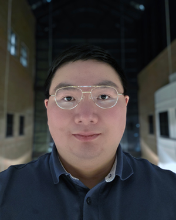
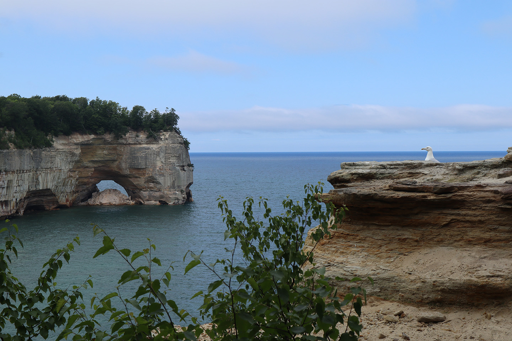

<html>
  <head>
    <title>Wenhao Peng, Ph.D. from Michigan</title>
  </head>

    <body>

<figure>

<figcaption>Porcupine Mountains: Summit Peak</figcaption>
</figure>

<figure>

<figcaption>Tahquamenon Falls: Lower Falls</figcaption>
</figure>

<figure>

<figcaption>Pictured Rocks: Miner's Castle</figcaption>
</figure>

<figure>

<figcaption>Sleeping Bear Dunes: Lake Michigan Overlook</figcaption>
</figure>

<figure>

<figcaption>Sleeping Bear Dunes: North Bar Lake Overlook</figcaption>
</figure>

<figure>

<figcaption>Brockway Mountain Drive West Bluff Overlook</figcaption>
</figure>

<figure>

<figcaption>Pictured Rocks: Mosquito Beach</figcaption>
</figure>

<figure>

<figcaption>Tawas Point: Lighthouse</figcaption>
</figure>

<figure>

<figcaption>Sleeping Bear Dunes: Sleeping Bear Point</figcaption>
</figure>

<figure>

<figcaption>Tahquamenon Falls: Upper Falls</figcaption>
</figure>

<figure>

<figcaption>Sleeping Bear Dunes: Dune Climb</figcaption>
</figure>

<figure>

<figcaption>Sleeping Bear Dunes: Empire Bluff Overlook</figcaption>
</figure>

<figure>

<figcaption>Porcupine Mountains: Escarpment Trail</figcaption>
</figure>

<figure>

<figcaption>Brockway Mountain Drive: Looking East</figcaption>
</figure>

<figure>

<figcaption>Porcupine Mountains Lake of the Clouds</figcaption>
</figure>

<figure>

<figcaption>Pictured Rocks: Lover's Leap</figcaption>
</figure>

<figure>

<figcaption>Pictured Rocks: Grand Portal</figcaption>
</figure>

Wenhao Peng received a B.S.E. degree in Electrical Engineering in 2018, an M.S. degree in Electrical and Computer Engineering (Integrated Circuits and VLSI) in 2019, and an M.S.E. degree in Mechanical Engineering (Dynamics and Vibrations) in 2024, all from the University of Michigan, Ann Arbor, MI, USA, where he defended his Ph.D. in Electrical and Computer Engineering (Applied Electromagnetics and RF Circuits) in January 2026. His research focuses on the design and modeling of acoustic wave resonators driven by thin-film piezoelectric and ferroelectric materials, such as aluminum nitride, scandium-doped aluminum nitride, and barium strontium titanate, with applications in frontend filters. He is also interested in developing fabrication technologies for resonant MEMS devices, as well as integrating acoustic wave resonator based filters in RF frontend modules.

Experience 

Skyworks Solutions, Inc. 
RF Acoustic Staff Electrical Engineer 

Feb 2026 - Present 

Irvine, California, United States 

Electrical and Computer Engineering at the University of Michigan 

Graduate Student Research Assistant 7 yrs 4 mos 

Ann Arbor, Michigan, United States 

Sep 2019 - Dec 2025 

Bulk acoustic wave resonators featuring polarization switchable functional thin film materials; funded by DARPA and NSF 

Graduate Student Research Assistant 

Sep 2018 - Aug 2019 

Reconfigurable DSP accelerator for software defined radio receivers; funded by DARPA 

Electrical and Computer Engineering at the University of Michigan 

Undergraduate Student Research Assistant May 2017 - Apr 2018 

Ann Arbor, Michigan, United States 

Wakeup receivers; funded by Intel 

Education 

University of Michigan

Doctor of Philosophy, Electrical and Computer Engineering 

Sep 2018 - Jan 2026 

Grade: 4.00/4.00 

Technical Area: Applied Electromagnetics and RF Circuits. 

BAW resonators featuring ferroelectric layers up to mm-Wave frequencies; design, modeling, fabrication, measurement, and characterization. 

University of Michigan 

Master of Science in Engineering, Mechanical Engineering  

Sep 2024 - Dec 2024 

Grade: 4.00/4.00 

Technical Area: Dynamics and Vibrations 

University of Michigan 

Master of Science, Electrical and Computer Engineering 

Sep 2018 - Dec 2019 

Grade: 4.00/4.00 

Technical Area: Integrated Circuits and VLSI 

University of Michigan 

Bachelor of Science in Engineering, Electrical Engineering, Summa Cum Laude 

2016 - 2018 

Grade: 4.00/4.00 

Academic previous experience from Shanghai 

Projects 
mm-Wave FBARs based on Periodically Poled AlN/ScAlN/AlN 

Jan 2022 - Dec 2025 

Designed resonators based on the Mason equivalent circuit model in ADS and multiphysics simulation in COMSOL. Analyzed the quality factor of different metals due to thermoelasticity. Derived a formula for the electromechanical coupling coefficient based on analytical methods in mechanical vibrations which translates it to the acoustic fields in the resonator, enabling efficient design and optimization. Explored different electrode options, layer stacks, and optimized layer thicknesses.
Improved the nanofabrication process involving lithography, dry etching, plasma etching, wet etching, and physical vapor deposition.
Improved the polarization switching process involving applying electrical pulses and observing and analyzing current readings. Electrical experiments with a ferroelectric tester and also an amplifier circuit with current probes.
Performed mm-Wave measurements utilizing on-wafer de-embedding structures with GSG probes and VNA.
Verified de-embedding structures with ADS Momentum and Ansys HFSS.
Analyzed measurement data with equivalent circuit models in ADS.
Tuned material properties in ADS for further design iterations.
Demonstrated good resonator performance at mm-Wave.

 

Intrinsically Switchable FBARs based on BST 

Sep 2019 - Dec 2021 

Designed resonators based on the Mason equivalent circuit model in ADS and multiphysics simulation in COMSOL.
Designed filters based on the Mason equivalent circuit model as well as the modified Butterworth Van Dyke model in ADS, utilizing the image parameter method.
Cleanroom nanofabrication involving oxidation, lithography, physical vapor deposition, wet etching, and dry etching.
Probed devices with GSG probes and VNA.
Analyzed data in ADS with equivalent circuit models.
Implemented a large signal model based on the phenomenology model for ferroelectric materials to account for the electric field dependent permittivity and coupling between the electrical and mechanical domains.

 

Courses 
Advanced Engineering Acoustics

MECHENG 524

 

Advanced Lasers and Optics Laboratory

Ve 438

 

Advanced Solid State Microwave Circuits

EECS 525

 

Advanced Vibrations of Structures

MECHENG 641

 

Analog Integrated Circuits

EECS 522

 

Computer Architecture

EECS 470

 

DSP Design Laboratory

EECS 452

 

Digital Communication Signals and Systems

EECS 455

 
Electromagnetics Theory I

EECS 530

 

Engineering Acoustics

MECHENG 424

 

Introduction to Cryptography

Ve 475

 
Introduction to MEMS

EECS 414

 
Math for Robotics

ROB 501

 
Mathematical Methods in Mechanical Engineering

MECHENG 501

 
Mechanical Vibrations

MECHENG 541

 
Microwave Circuits I

EECS 411

 
Monolithic Amplifier Circuits

EECS 413

 
Probabilistic Methods in Engineering

Ve 401
 
Theory of Solid Continua

MECHENG 511

 
VLSI Design I

EECS 427

 
VLSI Design II

EECS 627

 
Wave Propagation in Elastic Solids

MECHENG 645
 

