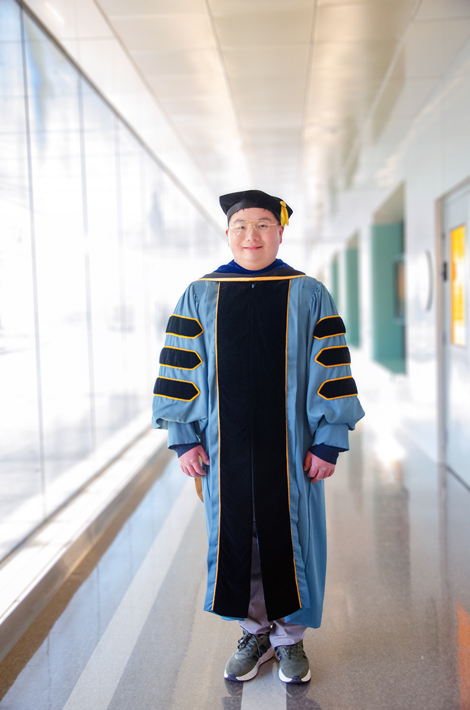
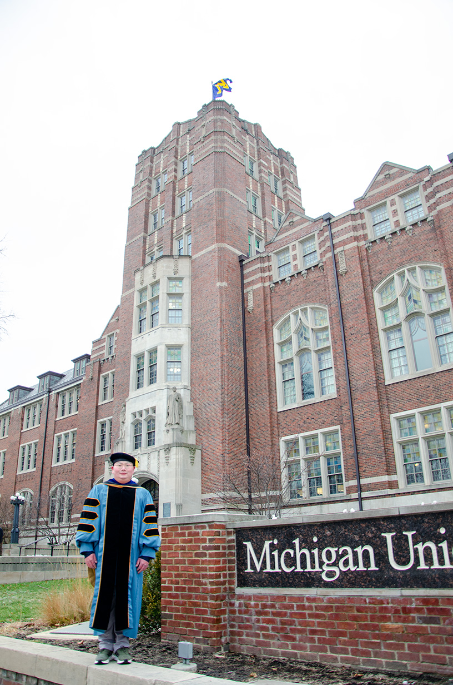
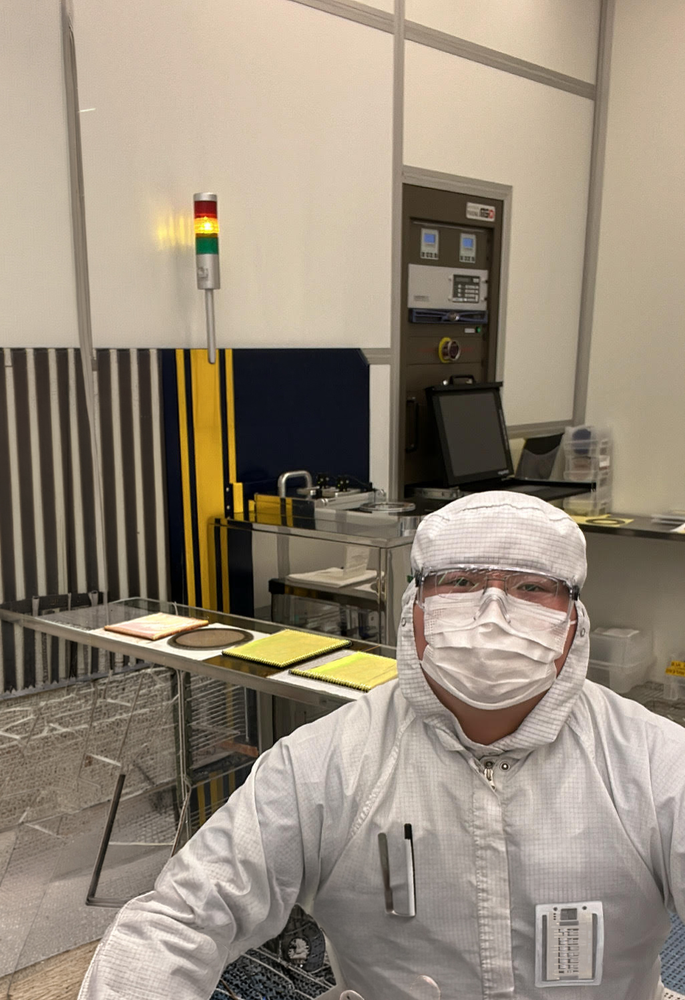
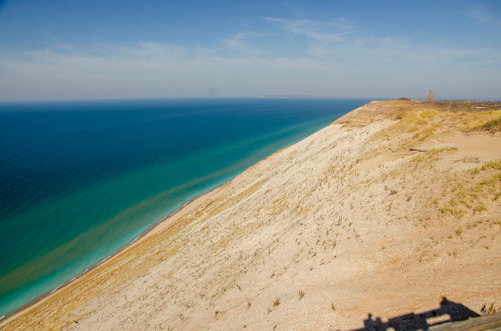
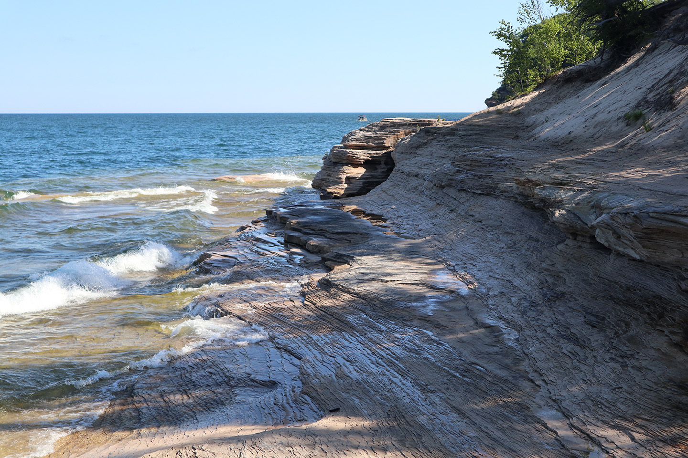
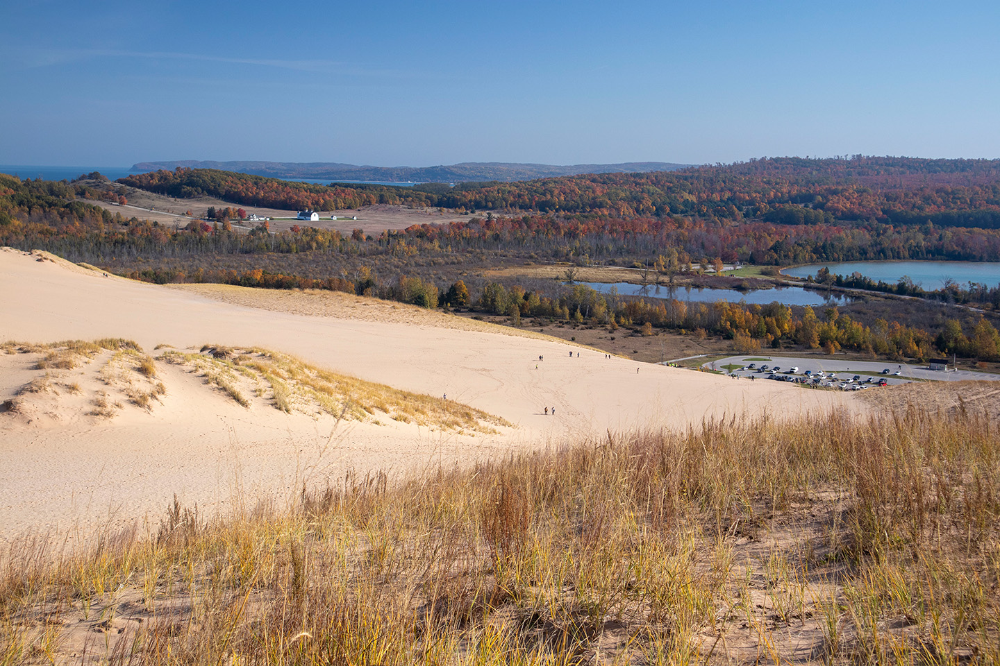
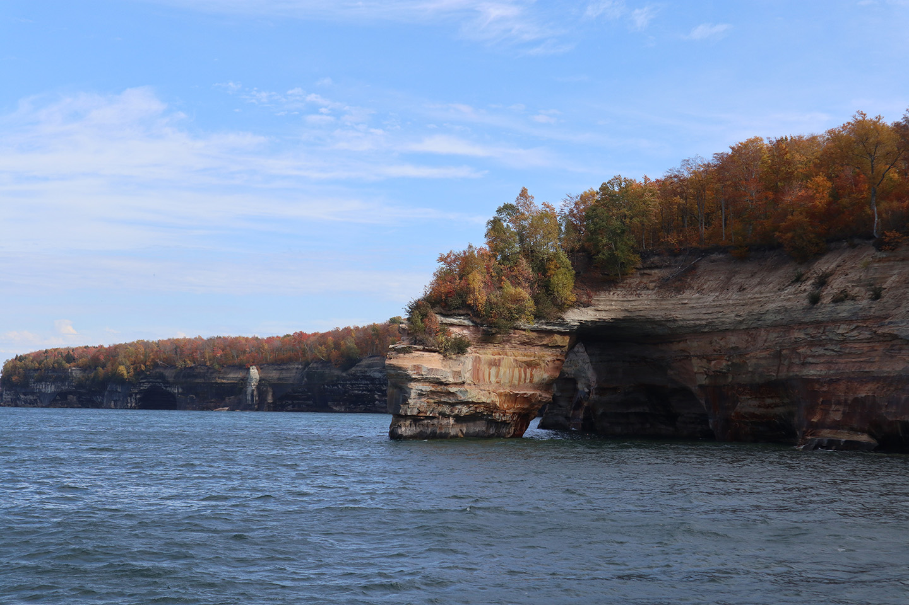

<html>
  <head>
    <title>Wenhao Peng, Ph.D. from Michigan</title>
  </head>

  <body>

Wenhao Peng received a B.S.E. degree in Electrical Engineering in 2018, an M.S. degree in Electrical and Computer Engineering (Integrated Circuits and VLSI) in 2019, and an M.S.E. degree in Mechanical Engineering (Dynamics and Vibrations) in 2024, all from the University of Michigan, Ann Arbor, MI, USA, where he defended his Ph.D. in Electrical and Computer Engineering (Applied Electromagnetics and RF Circuits) in January 2026. His research focuses on the design and modeling of acoustic wave resonators driven by thin-film piezoelectric and ferroelectric materials, such as aluminum nitride, scandium-doped aluminum nitride, and barium strontium titanate, with applications in frontend filters. He is also interested in developing fabrication technologies for resonant MEMS devices, as well as integrating acoustic wave resonator based filters in RF frontend modules.

Experience 
Skyworks Solutions, Inc. 
RF Acoustic Staff Electrical Engineer 
Irvine, California, United States 
Feb 2026 - Present 

Electrical and Computer Engineering at the University of Michigan 
Ann Arbor, Michigan, United States 
Research Assistant 
Sep 2019 - Dec 2025 
Bulk acoustic wave resonators featuring polarization switchable functional thin film materials; funded by DARPA and NSF 
Sep 2018 - Aug 2019 
Reconfigurable DSP accelerator for software defined radio receivers; funded by DARPA 
May 2017 - Apr 2018 
Wakeup receivers; funded by Intel 

Education 

University of Michigan
Doctor of Philosophy, Electrical and Computer Engineering 
Sep 2018 - Jan 2026 
Grade: 4.00/4.00 
Technical Area: Applied Electromagnetics and RF Circuits. 
BAW resonators featuring ferroelectric layers up to mm-Wave frequencies; design, modeling, fabrication, measurement, and characterization. 

University of Michigan 
Master of Science in Engineering, Mechanical Engineering  
Sep 2024 - Dec 2024 
Grade: 4.00/4.00 
Technical Area: Dynamics and Vibrations 

University of Michigan 
Master of Science, Electrical and Computer Engineering 
Sep 2018 - Dec 2019 
Grade: 4.00/4.00 
Technical Area: Integrated Circuits and VLSI 

University of Michigan 
Bachelor of Science in Engineering, Electrical Engineering, Summa Cum Laude 
2016 - 2018 
Grade: 4.00/4.00 
Academic previous experience from Shanghai 

Projects 
mm-Wave FBARs based on Periodically Poled AlN/ScAlN/AlN 
Jan 2022 - Dec 2025 
Designed resonators based on the Mason equivalent circuit model in ADS and multiphysics simulation in COMSOL. Analyzed the quality factor of different metals due to thermoelasticity. Derived a formula for the electromechanical coupling coefficient based on analytical methods in mechanical vibrations which translates it to the acoustic fields in the resonator, enabling efficient design and optimization. Explored different electrode options, layer stacks, and optimized layer thicknesses.
Improved the nanofabrication process involving lithography, dry etching, plasma etching, wet etching, and physical vapor deposition.
Improved the polarization switching process involving applying electrical pulses and observing and analyzing current readings. Electrical experiments with a ferroelectric tester and also an amplifier circuit with current probes.
Performed mm-Wave measurements utilizing on-wafer de-embedding structures with GSG probes and VNA.
Verified de-embedding structures with ADS Momentum and Ansys HFSS.
Analyzed measurement data with equivalent circuit models in ADS.
Tuned material properties in ADS for further design iterations.
Demonstrated good resonator performance at mm-Wave.
 

Intrinsically Switchable FBARs based on BST 
Sep 2019 - Dec 2021 
Designed resonators based on the Mason equivalent circuit model in ADS and multiphysics simulation in COMSOL.
Designed filters based on the Mason equivalent circuit model as well as the modified Butterworth Van Dyke model in ADS, utilizing the image parameter method.
Cleanroom nanofabrication involving oxidation, lithography, physical vapor deposition, wet etching, and dry etching.
Probed devices with GSG probes and VNA.
Analyzed data in ADS with equivalent circuit models.
Implemented a large signal model based on the phenomenology model for ferroelectric materials to account for the electric field dependent permittivity and coupling between the electrical and mechanical domains.
 

Publications 
  S. Nam, W. Peng, P. Wang, D. Wang, Z. Mi and A. Mortazawi, "A mm-Wave Trilayer AlN/ScAlN/AlN Higher Order Mode FBAR," in IEEE Microwave and Wireless Technology Letters, vol. 33, no. 6, pp. 803-806, June 2023, doi: 10.1109/LMWT.2023.3271865. 
  D. Wang, P. Wang, S. Mondal, J. Liu, M. Hu, M. He, S. Nam, W. Peng, S. Yang, D. Wang, Y. Xiao, Y. Wu, A. Mortazawi, and Z. Mi, “Controlled ferroelectric switching in ultrawide bandgap aln/scaln multilayers,” Applied Physics Letters, vol. 123, no. 10, p. 103506, 09 2023, doi: 10.1063/5.0160163. 
  W. Peng, S. Nam, D. Wang, Z. Mi and A. Mortazawi, "A 56 GHz Trilayer AlN/ScAlN/AlN Periodically Poled FBAR," 2024 IEEE/MTT-S International Microwave Symposium - IMS 2024, Washington, DC, USA, 2024, pp. 150-153, doi: 10.1109/IMS40175.2024.10600386. 
  S. Nam, M. Z. Koohi, W. Peng and A. Mortazawi, "A Switchless Quad Band Filter Bank Based on Ferroelectric BST FBARs," in IEEE Microwave and Wireless Components Letters, vol. 31, no. 6, pp. 662-665, June 2021, doi: 10.1109/LMWC.2021.3069880. 
  M. Z. Koohi, W. Peng and A. Mortazawi, "An Intrinsically Switchable Balanced Ferroelectric FBAR Filter at 2 GHz," 2020 IEEE/MTT-S International Microwave Symposium (IMS), Los Angeles, CA, USA, 2020, pp. 131-134, doi: 10.1109/IMS30576.2020.9223799. 
  W. Peng, M. Z. Koohi, S. Nam and A. Mortazawi, "Phenomenological Circuit Modeling of Ferroelectric-Driven Bulk Acoustic Wave Resonators," in IEEE Transactions on Microwave Theory and Techniques, vol. 70, no. 1, pp. 919-925, Jan. 2022, doi: 10.1109/TMTT.2021.3130609. 
  H. Desai, W. Peng and A. Mortazawi, "Single-Pole Single-Throw RF Acoustic Phase Inversion Switch Leveraging Poled Ferroelectrics," in IEEE Transactions on Microwave Theory and Techniques, vol. 73, no. 1, pp. 6-13, Jan. 2025, doi: 10.1109/TMTT.2024.3496665. 
  W. Peng, M. Z. Koohi, S. Nam and A. Mortazawi, "Physics Based Modeling of Electrostriction Based BAW Resonators," 2021 IEEE MTT-S International Microwave Symposium (IMS), Atlanta, GA, USA, 2021, pp. 214-217, doi: 10.1109/IMS19712.2021.9574949. 
  Y. Dai, W. Peng, Y. Wang, LX. Chuo, K. Suri, H. Zheng, D. Wentzloff, HS. Kim, "Implementation and Evaluation of Bi-Directional WiFi Back-channel Communication," 2018 IEEE 29th Annual International Symposium on Personal, Indoor and Mobile Radio Communications (PIMRC), Bologna, Italy, 2018, pp. 1-7, doi: 10.1109/PIMRC.2018.8580736. 
  W. Peng, S. Nam, D. Wang, Z. Mi and A. Mortazawi, "A 36 GHz Trilayer AlN/ScAlN/AlN Periodically Poled FBAR," 2025 IEEE/MTT-S International Microwave Symposium - IMS 2025, San Francisco, CA, USA, 2025, pp. 786-789, doi: 10.1109/IMS40360.2025.11103989. 

Courses 
Advanced Engineering Acoustics
MECHENG 524
 
Advanced Lasers and Optics Laboratory
Ve 438
 
Advanced Solid State Microwave Circuits
EECS 525
 
Advanced Vibrations of Structures
MECHENG 641
 
Analog Integrated Circuits
EECS 522
 
Computer Architecture
EECS 470
 
DSP Design Laboratory
EECS 452
 
Digital Communication Signals and Systems
EECS 455
 
Electromagnetics Theory I
EECS 530
 
Engineering Acoustics
MECHENG 424
 
Introduction to Cryptography
Ve 475
 
Introduction to MEMS
EECS 414
 
Math for Robotics
ROB 501
 
Mathematical Methods in Mechanical Engineering
MECHENG 501
 
Mechanical Vibrations
MECHENG 541
 
Microwave Circuits I
EECS 411
 
Monolithic Amplifier Circuits
EECS 413
 
Probabilistic Methods in Engineering
Ve 401
 
Theory of Solid Continua
MECHENG 511
 
VLSI Design I
EECS 427
 
VLSI Design II
EECS 627
 
Wave Propagation in Elastic Solids
MECHENG 645

Peer Review Contributions 
American Physical Society Physical Review: 2 
IEEE Journal of Microelectromechanical Systems: 3 
Science Direct Progress in Quantum Electronics: 1 

Links 
<a href="https://ieeexplore.ieee.org/author/37088530665">IEEE</a> 
<a href="https://www.linkedin.com/in/wenhaopengphdfrommichigan/">LinkedIn</a> 
<a href="https://orcid.org/0000-0003-2446-9658">ORCID</a> 
<a href="https://scholar.google.com/citations?user=uUKsgDIAAAAJ&hl=en">Google Scholar</a> 
<a href="https://www.scopus.com/authid/detail.uri?authorId=57205566158">Scopus</a> 
<a href="https://www.webofscience.com/wos/author/record/77158615">Web of Science</a> 
<a href="https://www.researchgate.net/profile/Wenhao_Peng2">Researchgate</a> 

